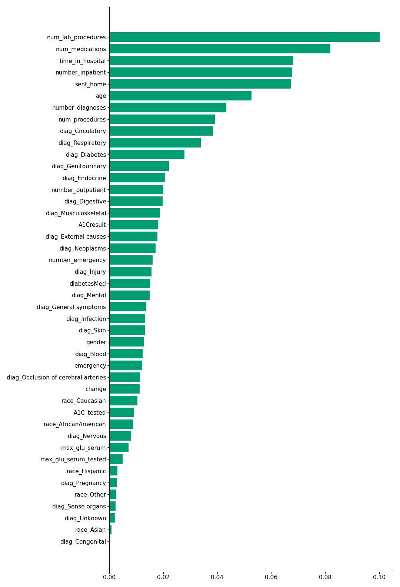

# Study: Hospital readmission of patients with diabetes

Analysis of hospital readmission of patients with diabetes using Python. The data set ([Diabetes 130-US hospitals for years 1999-2008](https://archive.ics.uci.edu/ml/datasets/Diabetes+130-US+hospitals+for+years+1999-2008#)) was compiled and made publicly available by [Strack et al. (2014)](https://pubmed.ncbi.nlm.nih.gov/24804245/). Downloaded from the [UCI Machine Learning Repository](https://archive.ics.uci.edu/ml/about.html).

Hospital readmissions (particularly those that happen within 30 days of a patient's discharge) is seen as a world-wide, high-priority health care quality measure and target for cost reduction. A more complete understanding of the underlying causes of readmission is needed to reduce its rate, thus any insights on these causes would cause a positive impact in health policies.

In this work I will try to answer the following questions:

- Are readmitted diabetic patients correctly diagnosed in their first admission?
- Given that HbA1c values are key for planning the diabetic patient's medication (according to the literature), how often HbA1c exams are asked by doctors in the inpatient setting?
- Are readmitted diabetic patients receiving appropriate medical intervention, like change in their medication or medical procedures if need be?
- Which variables are the strongest readmission predictors?
- And finally, would it be possible to create a predictive model for early readmission? Such a model could help plan interventions for high-risk patients and reduce emotional and financial costs for both patients and hospitals respectively. 

Please visit also the [blog post on Medium](https://brunoarine.medium.com/analyzing-and-predicting-hospital-readmission-of-patients-with-diabetes-69986513e7a4) about this project.

## View the notebook
You can view the notebook [here on Github](https://github.com/brunoarine/diabetes/blob/main/notebooks/diabetes.ipynb).

## Try the notebook
In your shell prompt, type the following:

```sh
git clone https://github.com/brunoarine/diabetes.git
```

After that, download the ([Diabetes 130-US hospitals for years 1999-2008](https://archive.ics.uci.edu/ml/datasets/Diabetes+130-US+hospitals+for+years+1999-2008#)) dataset and extract it to `/data`.

## Results


Logistic Regression metrics:

| Metric    | Value |
|-----------|-------|
| Precision | 0.14  |
| Recall    | 0.54  |
| F1        | 0.22  |
| AUC(ROC)  | 0.64  |

Random Forest Classifier metrics:

| Metric    | Value |
|-----------|-------|
| Precision | 0.17  |
| Recall    | 0.37  |
| F1        | 0.23  |
| AUC(ROC)  | 0.66  |

Most important features:



Key insights:

- Time in hospital (and indirectly number of lab procedures, number of procedures, and number of medications) could be an indicator of the patient's health. The longer the stay, the higher the probability of being readmitted within 30 days.
- Number of inpatient visits in the last year could also be an indicator of the patient's health, but longer term. It's also strongly correlated with early readmission.
- The older the patient, the higher the probability of early readmission after discharge.
- People who were discharged to their homes (instead of a skilled nursing facility, another short term hospital or clinic, etc.) are less likely to be readmitted within 30 days.
- Even after being diagnosed with diabetes-related symptoms, patients who didn't have their HbA1c levels checked were more prone to early readmission, most likely because they needed a medication change.

## Dependencies

- matplotlib 3.4.1
- numpy 1.20.2
- pandas 1.2.3
- seaborn 0.11.1
- scikit_learn 0.24.2

